# Images

## [Main Page](/README.md)

4 Section:
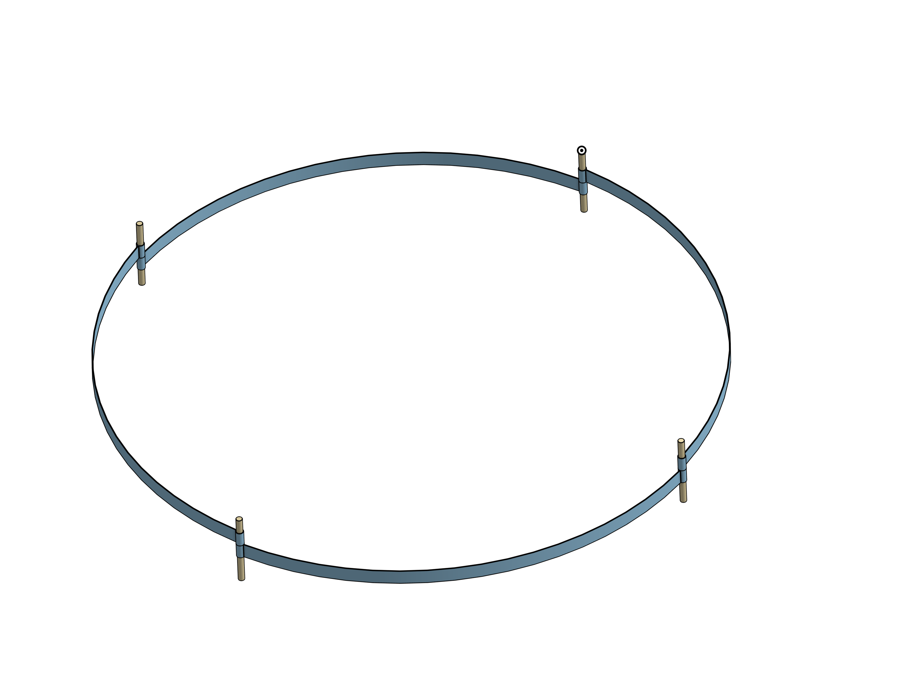

6 Section Assembly:
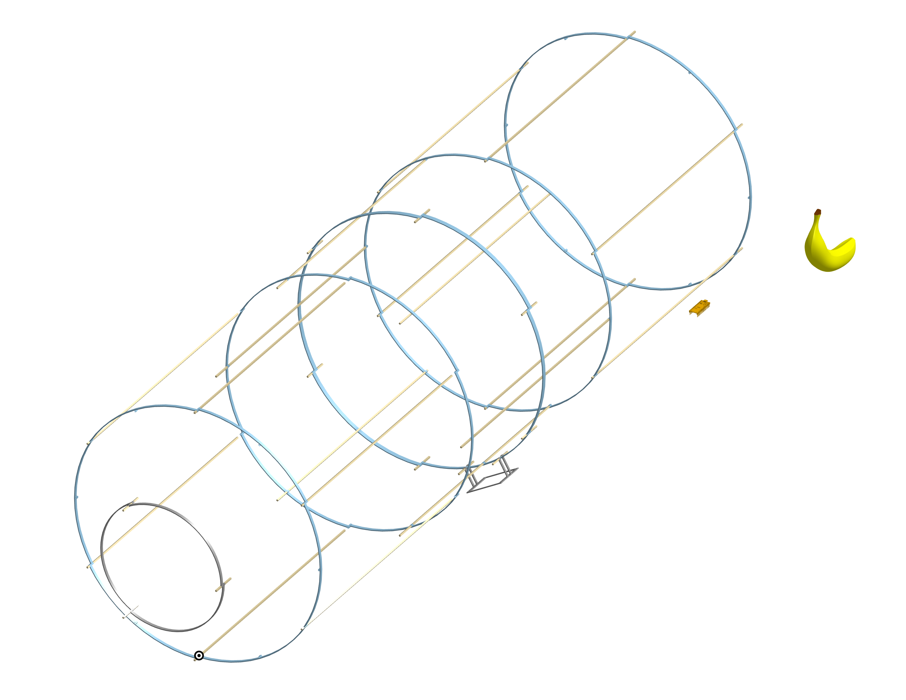

Airship Types
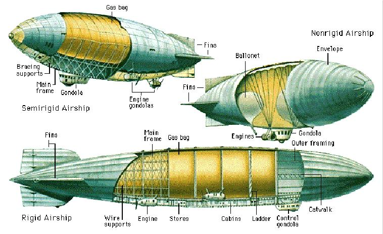

CAD V1:

End Goal:
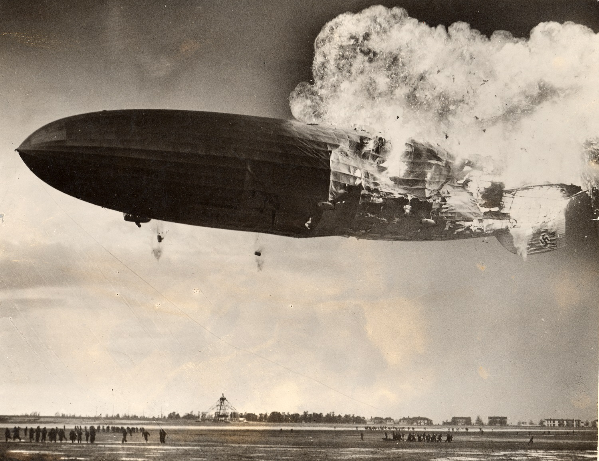

Final Diagram:
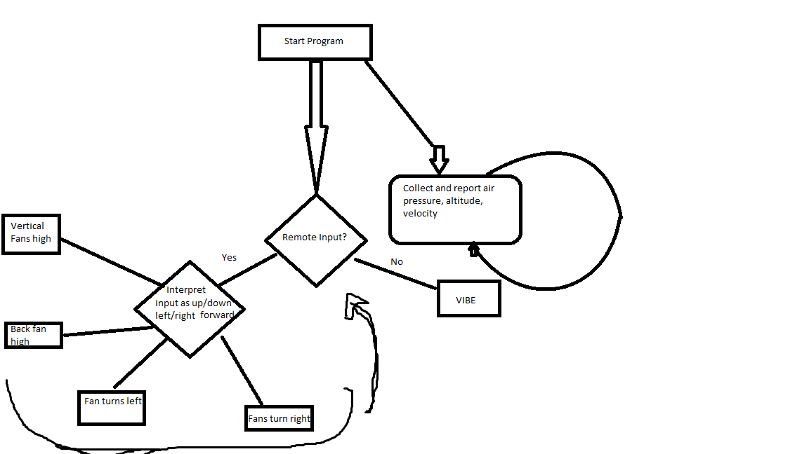

New Zeppelin Diagram, Front View:
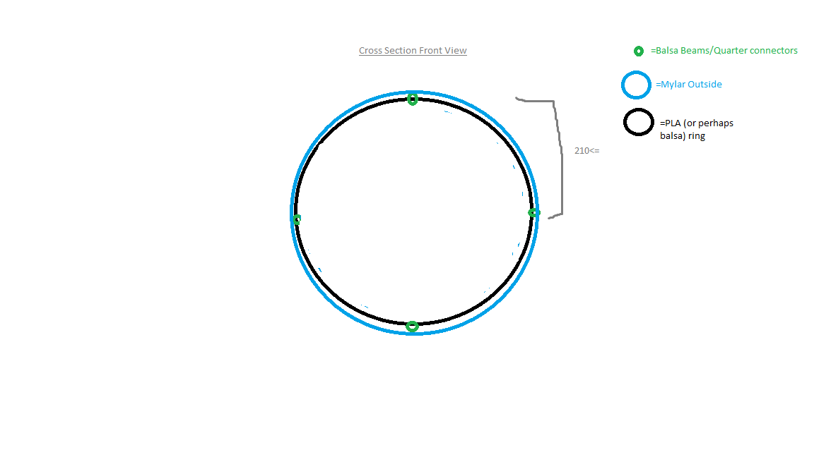

New Zeppelin Diagram, Side View:
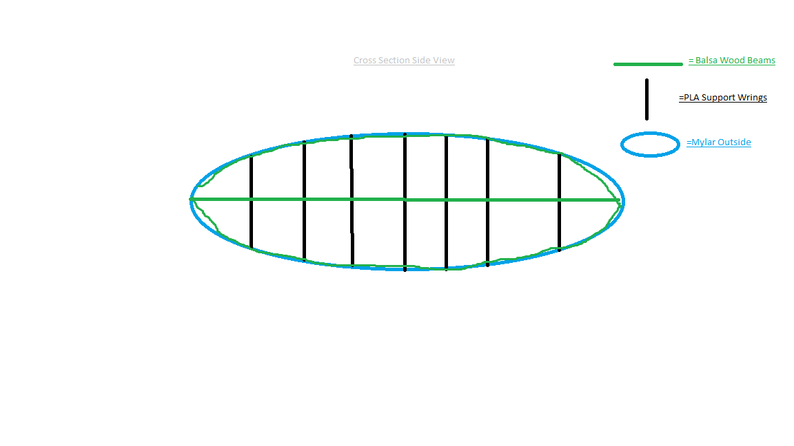

Pi Bird:
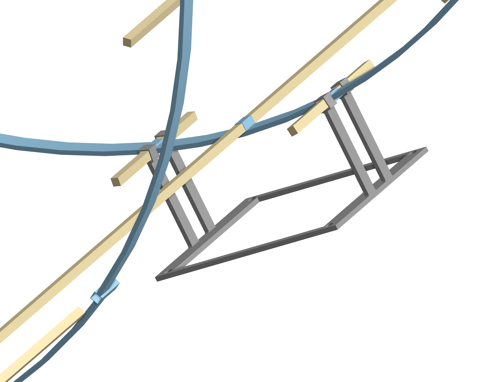

Prototype Diagram:
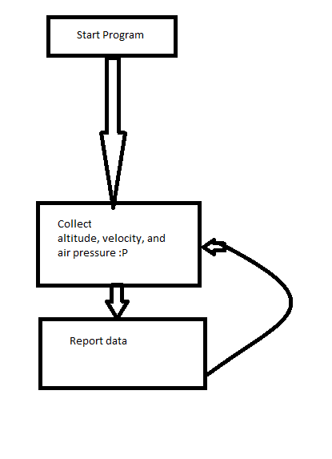

Spar Connector:
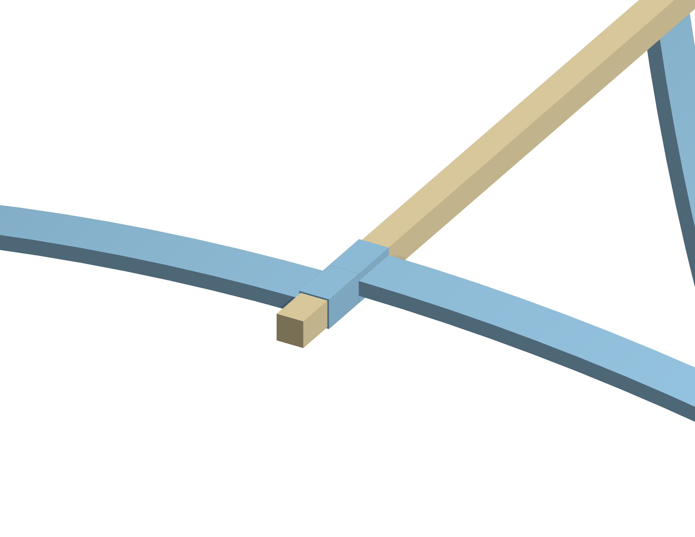

Wiring Diagram:
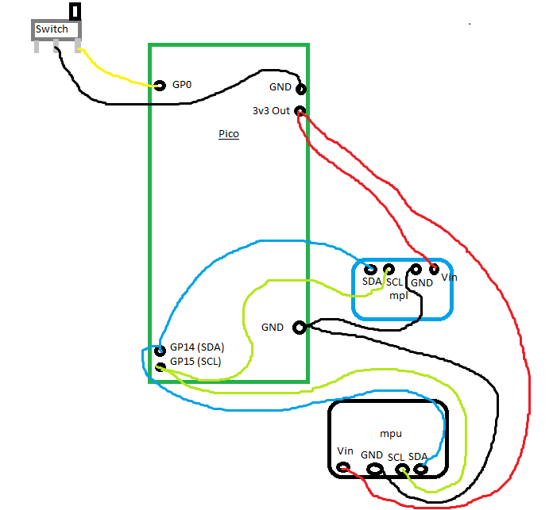

Zeppelin 1:
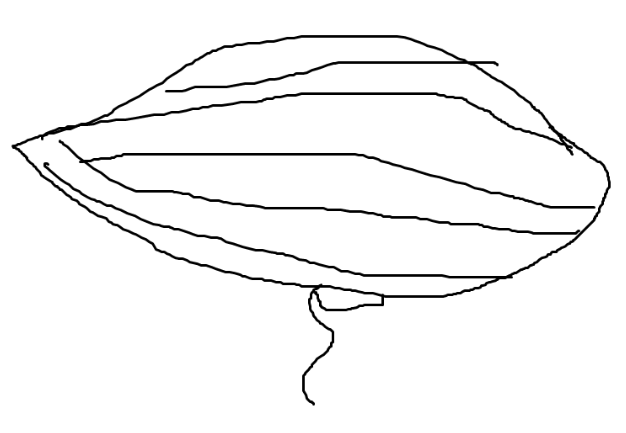

Zeppelin 2:
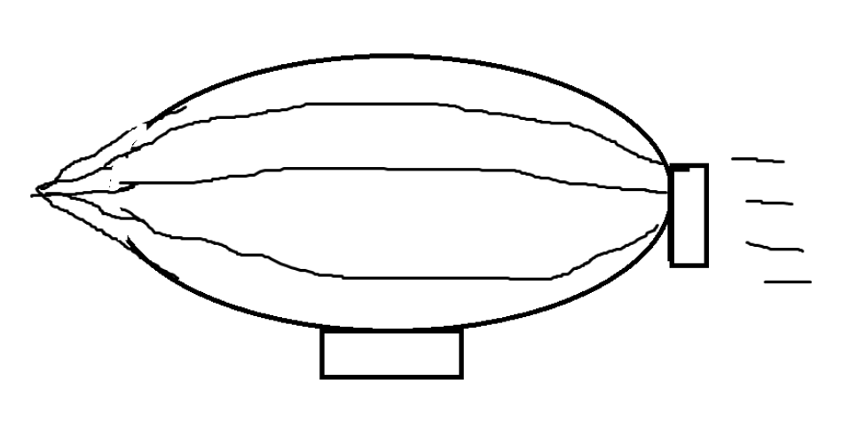
