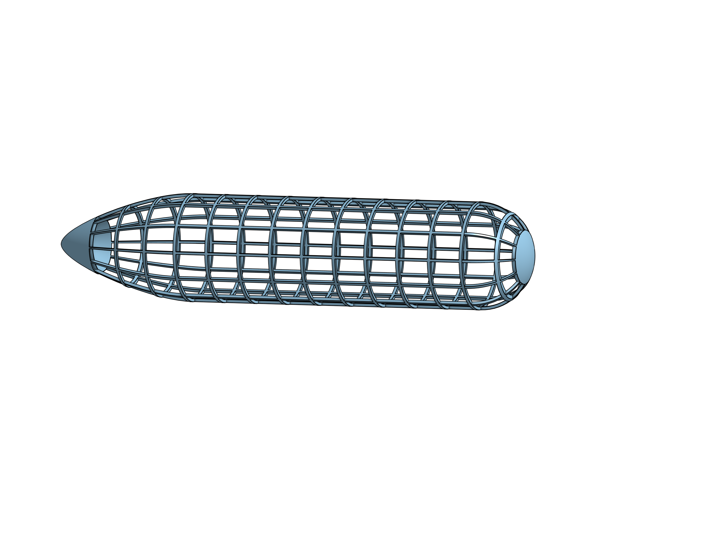

# Images

## [Main Page](/README.md)

4 Section:

6 Section Assembly:

Airship Types

CAD V1:

End Goal:

Final Diagram:

New Zeppelin Diagram, Front View:

New Zeppelin Diagram, Side View:

Pi Bird:

Prototype Diagram:

Spar Connector:

Wiring Diagram:

Zeppelin 1:

Zeppelin 2:

